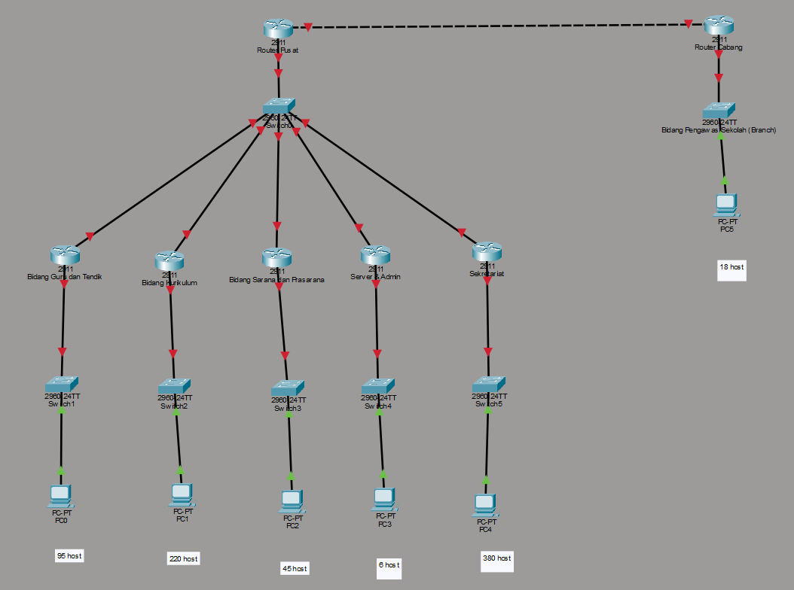

# Tugas 1 Jarkom
| Nama | NRP |
|----------|----------|
| Prabaswara Febrian Winandika | 5027241069 |

Yayasan Pendidikan ARA akan membangun jaringan untuk beberapa unit kerja. Sebagian unit berada di kantor pusat, sedangkan Bidang Pengawas Sekolah berada di kantor cabang. IP yang bisa digunakan 

### Kantor Pusat

| **Ruang**                        | **Jumlah Host Aktif** |
| -------------------------------- | --------------------- |
| Bidang Guru & Tendik             | 95 host               |
| Bidang Kurikulum                 | 220 host              |
| Bidang Sarana Prasarana          | 45 host               |
| Bidang Pengawas Sekolah (Branch) | 18 host               |
| Server & Admin                   | 6 host                |
| Sekretariat                      | 380 host              |

### Kantor Cabang

| **Ruang**               | **Jumlah Host Aktif** |
| ----------------------- | --------------------- |
| Bidang Pengawas Sekolah | 18 host               |

1. Rancanglah topologinya menggunakan Cisco Packet Tracer.
2. Setiap mahasiswa memiliki base network unik, dengan aturan: 
`10.(NRP mod 256).0.0`
**NRP 5027241069 mod 256 = 109, maka base: 10.109.0.0.**
3. Lakukan perhitungan subnetting dengan VLSM & CIDR di Spreadsheet untuk seluruh jaringan LAN dan link antar-router.
4. Konfigurasikan alamat IP di setiap interface router dan host pada CPT sesuai tabel hasil subnetting di Spreadsheet.

## Topologi

## VLSM
IP Prefix : 10.109.0.0/21

| Nama Jaringan                 | Host Dibutuhkan | Subnet Mask     | Prefix | Network     | Range Host                    | Broadcast     | Gateway         | Notes         |
|-------------------------------|-----------------|-----------------|---------|-------------|-------------------------------|----------------|-----------------|---------------|
| Sekretariat                   | 380             | 255.255.254.0   | /23     | 10.109.0.0  | 10.109.0.1 - 10.109.1.254     | 10.109.1.255  | 10.109.0.1      | VLSM TERBESAR |
| Bidang Kurikulum              | 220             | 255.255.255.0   | /24     | 10.109.2.0  | 10.109.2.1 - 10.109.2.254     | 10.109.2.255  | 10.109.2.1      |               |
| Bidang Guru & Tendik          | 95              | 255.255.255.128 | /25     | 10.109.3.0  | 10.109.3.1 - 10.109.3.126     | 10.109.3.127  | 10.109.3.1      |               |
| Bidang Sarana Prasarana       | 45              | 255.255.255.192 | /26     | 10.109.3.128| 10.109.3.129 - 10.109.3.190   | 10.109.3.191  | 10.109.3.129    |               |
| Bidang Pengawas Sekolah (HQ)  | 18              | 255.255.255.224 | /27     | 10.109.3.192| 10.109.3.193 - 10.109.3.222   | 10.109.3.223  | 10.109.3.193    |               |
| Server & Admin                | 6               | 255.255.255.248 | /29     | 10.109.3.224| 10.109.3.225 - 10.109.3.230   | 10.109.3.231  | 10.109.3.225    |               |
| Link HQ & Branch              | 2               | 255.255.255.252 | /30     | 10.109.3.232| 10.109.3.233 - 10.109.3.234   | 10.109.3.235  | HQ: 10.109.3.233| p2p link      |
| Kantor Cabang (Pengawas)      | 18              | 255.255.255.224 | /27     | 10.109.4.0  | 10.109.4.1 - 10.109.4.30      | 10.109.4.31   | 10.109.4.1      | cabang        |

## CIDR

| Nama     | Network/CIDR  | Prefix | Mask           | Range Host                 | Broadcast    | Gateway         | Notes                          |
|-----------|---------------|--------|----------------|----------------------------|---------------|-----------------|------------------------------|
| Summary   | 10.109.0.0/21 | /21    | 255.255.248.0  | 10.109.0.1 - 10.109.7.254  | 10.109.7.255 | Router Summary  | Supernet covering all subnets |

